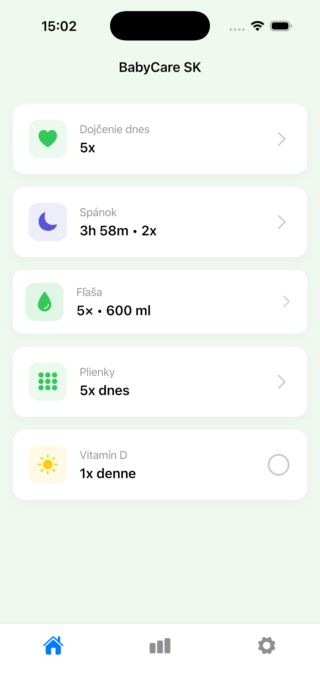
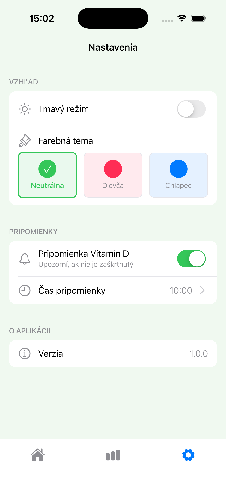

# BabyCare SK

BabyCare SK is a simple and practical baby-tracking app designed for everyday parenting.  
It helps families log the most important daily activities in one clear place.

## Product Screenshots

  
  

  <strong>HomeScreen</strong> &nbsp;|&nbsp; <strong>SettingsScreen</strong>

### More Screenshots

- [StatisticsScreen](screenshots/StatisticsScreen.png)
- [StatisticsScreen2](screenshots/StatisticsScreen2.png)
- [StatisticsScreen3](screenshots/StatisticsScreen3.png)
- [StatisticsScreenBoytheme](screenshots/StatisticsScreenBoytheme.png)
- [HomeScreenDark](screenshots/HomeScreenDark.png)

## Features

- 🤱 **Breastfeeding tracking** with quick daily records
- 😴 **Sleep tracking** to monitor baby rest patterns
- 🍼 **Bottle feeding logs** for better feeding overview
- 👶 **Diaper change tracking** to keep routines consistent
- 💊 **Vitamin D reminders** for daily supplement habits
- 🎨 **Theme support** for comfortable day/night usage

## Download and Launch

- 🍎 **App Store only:** [Download on the App Store](https://apps.apple.com/)

## Installation Notes

BabyCare SK is available exclusively through the Apple App Store.

## Contact the Developer

- 📧 Email: [your.email@example.com](mailto:your.email@example.com)
- 💬 Contact form: [Project Contact Form](https://example.com/contact)

---

Built with Flutter.
